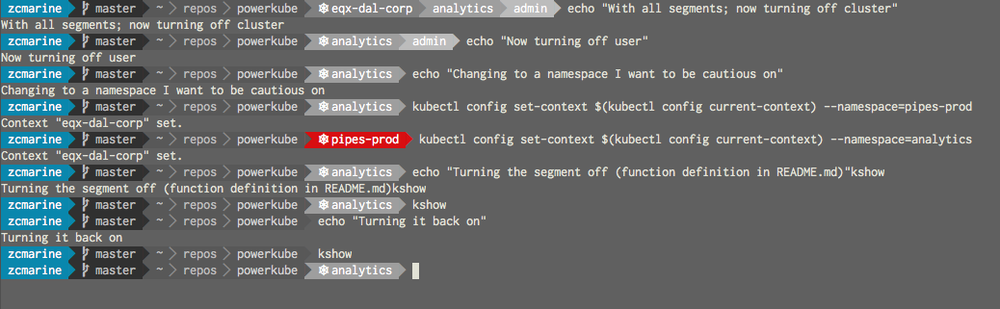

# Powerkube

Powerkube is a [Powerline](https://github.com/powerline/powerline) segment that shows your current Kubernetes context. It can be configured to show any or all of:
- the current cluster
- the current namespace
- the current user

Two other nifty features that it has are:

1. The ability to toggle on or off the powerkube segment using an environment variable which can easily be mapped to a function in your `~/.bash_profile`.
2. The ability to define certain namespaces to be colored differently for alerting purposes. For example, you could have your production namespaces show up in bright red.


The screenshot below demonstrates this functionality:



Note that powerkube currently only supports Python 2.7 due to a dependency, `kubernetes-py`, only being Python 2.7 compatible.

## Installation

1. **Add the Python package**.  Powerkube is not yet on pypi so we will need to either clone or download the repo and run `python setup.py develop` to add it to our $PATH. We can verify that it has been correctly installed by running the following command from the terminal:

    ```python
    python -c "import powerkube; print powerkube.__file__"
    ```

2. **Create a user configuration directory**. Once powerkube has been installed, we'll need to add it to our powerline shell's theme and colorscheme. The best way to do this is to alter our powerline user config, which will override the powerline defaults. If you don't already have a `~/.config/powerline/` folder, create it. Next we'll be copying some of the default powerline configs into this location. Find where powerline is installed by using `pip show powerline-status | grep 'Location'`, then navigate to the `config_files/` folder there. We'll be copying `config.json`, `themes/shell/default.json`, and `colorschemes/shell/default.json` to our `~/.config/powerline/` folder, adding the necessary folders to match that original file structure (i.e. adding the `themes/` and `colorschemes/` folders, etc.

3. **Add powerkube to your user config**. Within our user config, we'll need to add the powerkube segment to our shell by adding the following lines to our `~/.config/powerline/themes/shell/default.json`:

    ```json
    {
	    "function": "powerkube.context",
	    "priority": 30,
	    "args": {"show_cluster": true,
		     "show_namespace": true,
		     "show_user": true,
		     "alert_namespaces": ["data-prod", "infra-prod"]}
    }
    ```

    Next we'll add the highlighting colors we'll use to our `~/.config/powerline/colorschemes/shell/default.json`:

    ```json
    {
	    "name": "Default",
	    "groups": {
		    "kubernetes_cluster":         { "fg": "white", "bg": "gray6",     "attrs": [] },
		    "kubernetes_namespace":       { "fg": "white", "bg": "gray8",     "attrs": [] },
		    "kubernetes_namespace:alert": { "fg": "white", "bg": "brightred", "attrs": [] },
		    "kubernetes_user":            { "fg": "white", "bg": "gray9",     "attrs": [] }
	    }
    }
    ```


4. You may need to reload powerline with `powerline-daemon --replace` to load the new settings. That's it!

5. (Optional) By default powerkube will render the kubernetes context if the enviroment variable `RENDER_POWERLINE_KUBERNETES` is either set to `YES` or is not set at all. Rather than setting this variable manually, you can create a simple `kshow` function by placing the following in your `~/.bash_profile`:

    ```bash
    kshow() {
        if [[ $RENDER_POWERLINE_KUBERNETES = "NO" ]]; then
	    export RENDER_POWERLINE_KUBERNETES=YES
        else
	    export RENDER_POWERLINE_KUBERNETES=NO
        fi
    }
    ```

You're all set up! Happy coding!

## License

Licensed under the [Apache License 2.0](LICENSE).
